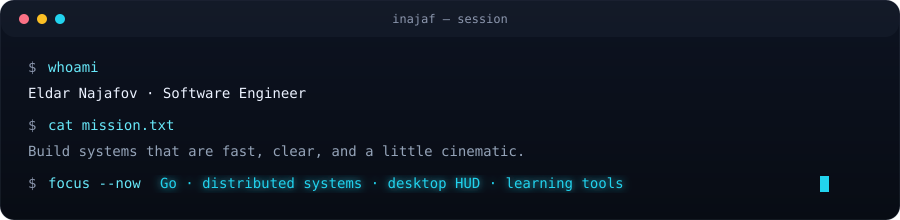

<!--
  GitHub Profile · inajaf
  Futuristic glass-HUD design language (aligned with Pulsebar)
-->

<div align="center">
  
</div>

<br/>

<div align="center">
  
</div>

<div align="center">
  
</div>

<br/>

## ▸ About

Software engineer focused on **production Go**, **distributed systems**, and
**tools with a pulse** - from interactive courses to macOS HUD monitors.

I care about clean architecture, real tests, and interfaces that feel
alive rather than static.

<p align="center">
  <a href="https://inajaf.github.io/go-professional">
    
  </a>
  <a href="https://github.com/inajaf/pulsebar">
    
  </a>
  <a href="https://github.com/inajaf">
    
  </a>
</p>

---

## ▸ Featured systems

<table>
  <tr>
    <td width="50%" valign="top">
      <h3>🖥️ <a href="https://github.com/inajaf/pulsebar">pulsebar</a></h3>
      <p>
        Futuristic menu-bar system monitor for macOS.<br/>
        Glass HUD gauges for CPU / GPU / RAM / Disk, top processes, native alerts.
      </p>
      <code>Tauri · SvelteKit · Rust</code>
    </td>
    <td width="50%" valign="top">
      <h3>📘 <a href="https://github.com/inajaf/go-professional">go-professional</a></h3>
      <p>
        Interactive course on production-grade Go &amp; distributed systems.<br/>
        Live animations, multi-language UI, local-first.
      </p>
      <code>JavaScript · pedagogy · systems</code><br/>
      <a href="https://inajaf.github.io/go-professional">→ open course</a>
    </td>
  </tr>
  <tr>
    <td width="50%" valign="top">
      <h3>🧪 <a href="https://github.com/inajaf/learn-and-go">learn-and-go</a></h3>
      <p>
        Hands-on Go path: interfaces, gRPC, messaging, concurrency,
        databases, HTTP APIs, production patterns.
      </p>
      <code>Go · tests · real examples</code>
    </td>
    <td width="50%" valign="top">
      <h3>🎬 <a href="https://github.com/inajaf/video-enhance">video-enhance</a></h3>
      <p>
        Local web UI for video cleanup and AI upscaling -
        privacy-first processing on your machine.
      </p>
      <code>Go · local AI · web UI</code>
    </td>
  </tr>
  <tr>
    <td width="50%" valign="top">
      <h3>📚 <a href="https://github.com/inajaf/learning-materials">learning-materials</a></h3>
      <p>
        Categorized library of technical learning materials.
      </p>
      <code>JavaScript · knowledge base</code>
    </td>
    <td width="50%" valign="top">
      <h3>🍺 <a href="https://github.com/inajaf/homebrew-tap">homebrew-tap</a></h3>
      <p>
        Homebrew tap for shipping apps cleanly.
      </p>
      <code>Ruby · distribution</code>
    </td>
  </tr>
</table>

---

## ▸ Stack

<p align="center">
  
  
  
  
  
</p>

---

## ▸ Telemetry

<div align="center">
  
  
</div>

<br/>

<div align="center">
  
</div>

<br/>

<div align="center">
  
</div>

---

## ▸ Now

```text
┌─────────────────────────────────────────────────────────────┐
│  STATUS     focusing                                        │
│  BUILDING   pulsebar · go-professional · local tools        │
│  LEARNING   deeper distributed systems · desktop UX         │
│  SIGNAL     clean code · real tests · cinematic UI          │
└─────────────────────────────────────────────────────────────┘
```

<p align="center">
  
</p>

<p align="center">
  <sub>
    <code>// designed like a HUD - not a resume dump</code><br/>
    <a href="https://github.com/inajaf">github.com/inajaf</a>
    ·
    <a href="https://inajaf.github.io/go-professional">go-professional</a>
  </sub>
</p>
