  

 

  

 

## ▸ About

Software engineer focused on **production Go**, **distributed systems**, **AI development** and
**building Reliable Software** - From small projects to large-scale, high-performance applications .

I care about clean architecture, real tests, and interfaces that feel
alive rather than static.

  
  
  

---

## ▸ Stack

  
  
  
  
  

