<!--
  GitHub Profile · inajaf
  Futuristic glass-HUD design language (aligned with Pulsebar)
-->

  

 

  

  

 

## ▸ About

Software engineer focused on **production Go**, **distributed systems**, and
**tools with a pulse** - from interactive courses to macOS HUD monitors.

I care about clean architecture, real tests, and interfaces that feel
alive rather than static.

  
  
  

---

## ▸ Featured systems

  

  
  
  

---

## ▸ Stack

  
  
  
  
  

---

## ▸ Telemetry

  
  

 

  

 

  

